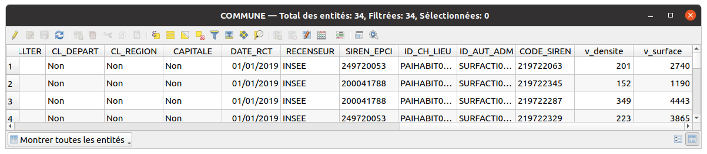

# La calculatrice de champ

La calculatrice de champ est un outil accessible avec le `boulier` dans la fenêtre de la table attributaire ou dans la barre d'outil `Attributs` de QGIS.
Il permet la mise à jour d'un champ existant ou alors de créer un nouveau champ.

## L'interface

La boîte de dialogue est très proche de celle de l'**éditeur d'expressions**,
avec en haut un nouveau bloc pour configurer quels sont les champs **à créer** ou **à modifier**


A partir de cette interface, on peut soit:

* créer un **nouveau champ** qui sera rempli avec le résulat de l'expression
* créer un **champ virtuel** qui sera rempli dynamiquement avec le résultat de l'expression

## Les champs virtuels

Ces champs ne sont pas enregistrés dans la source de la couche, mais seulement
dans les propriétés de la couche du projet QGIS.

Pour créer un champ virtuel, il faut bien **cocher la case** `Créer un champ virtuel`.

Par exemple, on peut créer :

* un champ virtuel `v_densite` qui va permettre de calculer la
  densité de population par kilomètre carré. `"POPULATION" / ($area / 1000000)`
* un champ virtuel `v_surface` qui va récupérer la surface en hectare à partir
  de la géométrie : `to_int( $area / 10000 )`

Lorsqu'on ouvre la table attributaire, ces deux champs sont affichés à droite :



On peut aussi voir ces champs dans l'onglet `Champs` des **propriétés de la couche** QGIS.


On peut modifier l'expression utilisée en cliquant sur le bouton Epsilon visible
dans le commentaire de chaque champ virtue.

## Créer des champs

Pour créer des champs, on peut faire exactement la même chose,
sauf qu'il faut décocher la case `Créer un champ virtuel` dans la calculatrice.

La différence, c'est qu'alors QGIS va ajouter **un nouveau champ** à votre couche.
Il sera donc exploitable dans tous les projets QGIS utilisant cette source de données

-> Tester en :

* créant un nouveau champ `densite` avec la même formule,
* modifiant une géométrie, ou créer une nouvelle commune
* voir comment évoluent les valeurs pour les champs `v_densite` et `densite`

Par contre, **il ne sera pas dynamique**. Si on modifie la géométrie, la surface et la densité
devront être recalculées.

!!! tip
    **Pour toutes modifications d'une couche vecteur**, on doit se placer dans une session d'édition, à l'aide du petit stylo dans la barre d'outils `Numérisation` ou dans la fenêtre de la table attributaire.

## Modifier des valeurs attributaires

On peut utiliser les expressions pour modifier les valeurs d'un champ
pour **tous les objets** de la couche ou seulement pour les **objets sélectionnés**.

Pour cela, il suffit

* d'ouvrir la **table attributaire**
* de passer la couche en **mode édition** avec le bouton `Crayon`
* d'utiliser le champ de **saisie d'expression** en haut de la table
* d'appliquer sur tous les objets ou sur les objets sélectionnés


!!! tip
    Pas de souci si on s'est trompé et qu'on a modifié par erreur des données.
    Les modifications sont enregistrées dans l'historique et peuvent être
    annulées tant qu'on n'a pas cliqué sur le bouton d'enregistrement.

On peut aussi utiliser la **calculatrice de champs** pour lancer cette modification.
Alors, il faut bien contrôler que

* la case `Ne mettre à jour que les N entités sélectionnées` est cochée (si on le souhaite)
* le champ choisi est bien le bon dans la **liste déroulante**.


## Modifier les géométries

On peut tout à fait **modifier les géométries** d'une couche spatiale avec des expressions.

Pour cela, il suffit

* d'ouvrir la **calculatrice de champs**,
* de sélectionner `<geometry>` dans la liste déroulante des champs
* utiliser une expression compatible avec les géométries

Par exemple, on peut créer une géométrie de type point à partir de `longitude` et `latitude`

```sql
make_point("longitude", "latitude")`
```

On peut aussi déplacer des points aléatoirement:

```sql
with_variable(
	'distance_floutage',
	1000,
	translate(
		$geometry,
		randf(-1 * @distance_floutage, @distance_floutage),
		randf(-1 * @distance_floutage, @distance_floutage)
	)
)
```

De nombreuses possibilités sont offertes par QGIS pour **manipuler les géométries**
avec les expressions :

* création de géométries (lignes, polygones, etc.)
* tampons sur les géométries
* récupération du nombre de noeuds, de parties
* etc.
