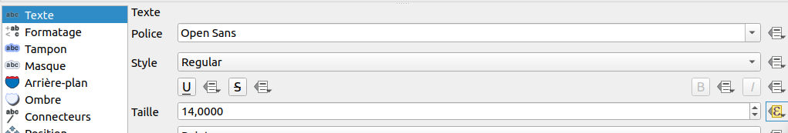
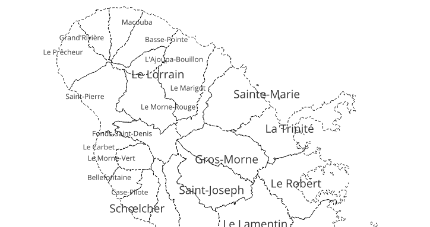
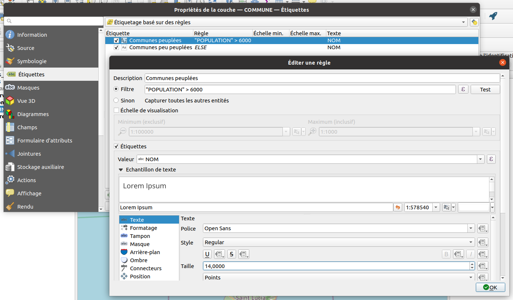

# Les étiquettes et les expressions

Comme pour la symbologie, il y a trois manières d'utiliser **les expressions dans l'étiquetage**:

* Utiliser une expression pour **construire l'étiquette**
* Faire **varier des propriétés** (couleur, taille du texte, etc.) selon les valeurs
* Utiliser l'**ensemble de règles** pour créer différentes configurations

## Utilisation d'une expression pour construire l'étiquette

Par défaut, nous avons utilisé un champ de notre attributaire pour construire notre étiquette.

Nous souhaiterions désormais vouloir étiqueter en utilisant deux champs : le nom de la commune ET son code INSEE.
Il faut désormais utiliser le petit epsilon violet, qui comme vu dans la [présentation de l'interface](./interface.md)
fait référence à la notion des **expressions**.

* Pour afficher le nom de la commune avec le code INSEE
    * Attention aux différents opérateurs `+`, `||` et `concat()` qui permettent tous de concaténer des chaînes, mais
    attention aux valeurs NULL et aux valeurs mathématiques. On recommande `concat` bien qu'elle soit un peu plus complexe.
    * Solution `concat("NOM", '\n', "CODE_INSEE")`

* afficher une information calculée à la volée, comme la superficie de la commune en km² :
    * La superficie en anglais se dit `area`.
    * La projection de la couche est actuellement en m, donc la surface est en m².
    * Solution partielle `$area / 1000000`
    * Solution finale `concat("NOM", '\n', round($area / 1000000, 2), ' km²')`

* changer pour afficher la densité de population
    * Solution `concat("NOM", '\n', round("POPULATION" / ($area / 1000000, 2)), ' hab/km²')`

## Faire varier des propriétés

Un exemple simple serait de modifier la taille du texte en fonction de la population de la commune :

```sql
CASE
    WHEN "POPULATION" > 6000 THEN 14
    ELSE 9
END
```



Le résultat:



## Étiquettes par ensemble de règles

Comme pour la symbologie, on peut créer des règles d'affichage
dont le filtre est basé sur une expression.

On peut ainsi faire varier l'étiquette

* selon l'échelle
* l'importance de l'objet (communes peuplées, etc.)
* l'objet actif dans l'atlas

Par exemple pour les communes :


