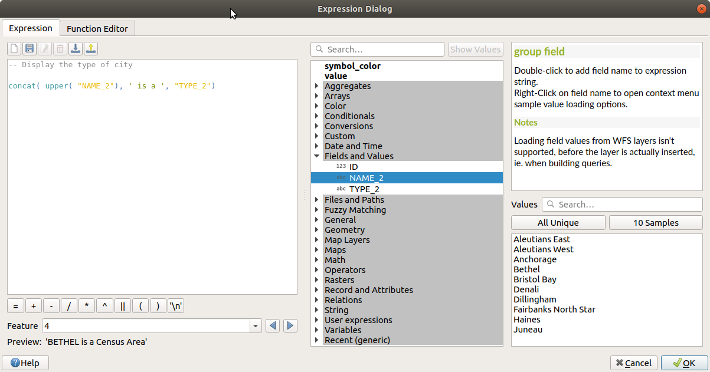

# Les expressions

## Introduction

Les **expressions** sont omniprésentes dans QGIS. Il est important de les maîtriser un minimum
si vous voulez pleinement exploiter les possibilités de QGIS.

On les retrouve dans les outils suivants :

* **Nommage** d'une entité vectorielle
* **Affichage d'infobulles** au survol d'un objet sur la carte
* **Calculatrice de champ** pour créer des valeurs à partir de calculs sur les champs d'une couche
* **Modification des données** à partir d'un calcul sur les champs
* **Sélection des objets** par une condition
* **Contrôle des propriétés de mise en forme** dans la symbologie, l'étiquetage, l'impression, etc.
* **Utilisation du générateur de géométries** pour enrichir la symbologie
* **Mise en forme** de la table attributaire (et des tables dans les mises en page)
* **Formulaires d'édition** avec la possibilité de définir des valeurs par défaut,
  un contrôle sur les valeurs saisies et un affichage dynamique
* **Outil de mise en page** pour imprimer des atlas dynamiques
* **Algorithmes** du menu `Traitements`

Elles sont écrites à l'aide de l'**éditeur d'expression** de QGIS,
qui est accessible dans les outils de QGIS via les boutons montrant
le symbole **Epsilon** .

## L'éditeur d'expressions

Pour ouvrir l'éditeur, vous pouvez par exemple

* sélectionner une couche dans la légende
* cliquer sur l'icône  dans la barre d'outil de sélection

La fenêtre de l’**éditeur d’expression** vous donne accès à:

* l’onglet `Expression` qui, grâce à un large choix de fonctions prédéfinies,
  vous permet d’écrire et de vérifier l’expression à utiliser;
* l’onglet `Editeur de fonction` qui permet d’étendre cette liste
  par la création de vos propres fonctions.

L’onglet `Expression` fournit l’**interface principale** pour écrire
des expressions en utilisant des fonctions,
des champs de couche et des valeurs. Il contient les widgets suivants :

Une **zone d’édition** d’expressions pour taper ou coller des expressions.
L’**auto-complétion** est disponible pour accélérer l’écriture des expressions :

* Les **noms de variables**, de **fonctions** ou **d’attributs** correspondants
  au texte d’entrée sont indiqués en-dessous : utiliser les touches de flèches
  `Up` et `Down` de votre clavier pour naviguer entre les éléments proposés
  et appuyer sur la touche `Tab` pour insérer l’élément dans l’expression
  ou bien cliquer sur l’élément souhaité.
* Les **paramètres des fonctions** sont affichés lors de leur complétion.
* QGIS vérifie également la **validité de votre expression** et
  met en valeur les **erreurs** avec :
  * Un **soulignement** : pour les fonctions inconnues, fausses ou des arguments invalides ;
  * Un **marqueur** : pour toutes les autres erreurs (par exemple une parenthèse
    manquante, un caractère inattendu) à la position problématique.

**Au-dessus** de l’éditeur d’expressions, un **ensemble d’outils** vous aide :

* **vider** l’éditeur d’expression
* **créer et gérer** vos expressions sauvegardées

**Sous l’éditeur** d'expression, vous trouvez :

* un ensemble d’**opérateurs de base** pour vous aider à construire l’expression
* une indication du f**ormat de sortie attendu** lorsque vous définissez
  les données par les propriétés des entités
* une **prévisualisation** de la sortie de l’expression, évaluée sur la première
  entité de la couche par défaut. Vous pouvez parcourir et évaluer les autres
  entités de la couche en utilisant la liste déroulante (les valeurs sont tirées
  de la propriété d'affichage de la couche).
* En cas **d’erreur**, il l’indique et vous pouvez accéder aux détails
  grâce à l’hyperlien fourni.

Un **sélecteur de fonctions** affiche la liste des **fonctions**, des variables,
des champs organisés par groupes. Un **champ de recherche** est disponible
pour filtrer la liste et trouver rapidement une fonction particulière ou un champ.

La documentation complète de toutes les fonctions est accessible dans
la [documentation QGIS](https://docs.qgis.org/3.22/fr/docs/user_manual/expressions/functions_list.html#functions-list).

* **Double-cliquer** sur le nom d’un objet l’ajoute au texte de l’expression en cours
de rédaction dans la zone d’éditeur.
* Un **onglet d’aide** affiche l’aide pour chaque objet sélectionné dans le sélecteur de fonction.

!!! tip
    Faites un `Ctrl+Clic` lorsque vous survolez le nom d’une fonction dans une expression
    pour afficher automatiquement son **aide** dans la boîte de dialogue.

Le bloc de prévisualisation des **valeurs d’un champ** affiché lorsqu’un champ
est sélectionné dans le sélecteur de fonction permet de récupérer
les attributs des entités :

* `Rechercher` une valeur de champ particulière
* Afficher la liste des valeurs de `Toutes les valeurs uniques` ou d'un
  `Echantillon de 10 valeurs`.

Un **double-clic** sur la valeur d’un champ dans le widget
l’ajoute à l’éditeur d’expressions.

## Écrire une expression

Les expressions QGIS sont utilisées pour **sélectionner des entités**
ou **calculer des valeurs**. Le langage emprunte quelques conventions
au langage `SQL` (pour faire des requêtes dans les bases de données)

L’écriture d’une expression dans QGIS suit certaines règles :

* le **nom d'un champ** est entre guillemet double : `"INSEE_COM"`.
* une **chaîne de caractère** entre guillemet simple : `'une valeur'`.
* on peut effectuer des **calculs arithmétiques** sur des
  nombres (entiers ou réels) : `(1 + 2 - (3 * 4)) / 5`
* on peut **concaténer** des chaînes de caractères : `'Les expressions' || ' dans QGIS'`
* on peut appeler des **fonctions** qui transforment des valeurs en **paramètres**
  et renvoient une **valeur** : `to_date('01/01/2022', 'dd/MM/yyyy')`
* selon le **contexte**, on souhaite que l'expression renvoie :
  * une `valeur` textuelle, entière, une chaîne de caractère, par exemple pour calculer une densité
  * un booléen: `Vrai` ou `Faux`, par exemple pour filtrer
  * une `géométrie`, par exemple pour l'afficher

!!! tip
    Certaines fonctions nécessitent le réglage de **nombreux paramètres**.
    Le moteur d’expression supporte l’utilisation de **paramètres nommés**.
    Cela signifie qu’au lieu d’écrire l’expression cryptique `clamp( 1, 2, 9)`,
    vous pouvez utiliser `clamp( min:=1, value:=2, max:=9)`.

## Sauvegarde des expressions

Dans la **barre d'outil** affichée au-dessus de l'éditeur d'expressions,
vous pouvez lancer des actions pour sauvegarder
et retrouver des expressions.

Elles sont enregistrées dans votre profile QGIS utilisateur
(sur votre poste de travail) et sont disponibles dans toutes
les boîtes de dialogues de saisie d'expression de QGIS.

On y retrouve :

*  **Ajouter** l’expression courante
  aux expressions de l’utilisateur :
  stocker l’expression dans le **profil de l’utilisateur**.
  Une **étiquette** et un **texte d’aide** peuvent être ajoutés pour faciliter l’identification.
* **Modifier** l’expression sélectionnée parmi les expressions utilisateur,
  ainsi que leur aide et leur libellé
*  **Supprimer** l’expression sélectionnée
  des expressions de l’utilisateur
*  **Importer** des expressions utilisateur
  depuis un fichier .json dans le dossier du profil utilisateur actif
*  **Exporter** les expressions utilisateur
  comme un fichier .json ; toutes les expressions utilisateur dans le sont exportées profil utilisateur (fichier `QGIS3.ini`)
