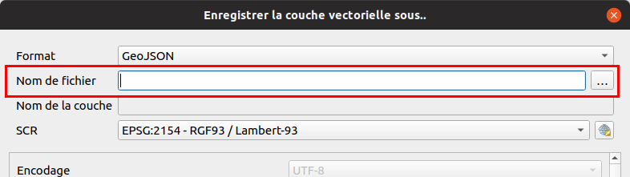

# La sélection par expression

## Utilisation de l'outil

On peut utiliser les expressions pour **rechercher des données** dans une couche vecteur.
Il existe par exemple l'outil de **sélection par expression** qui permet de
surligner en jaune tous les objets qui correspondent à un **filtre**.

La couche `commune` comporte de nombreuses entités. On peut le voir graphiquement sur le canevas de la carte,
mais aussi en ouvrant sa **table attributaire**.

* Pensez-bien à **sélectionner votre couche** dans la légende. Cela active ou non les actions dans la **barre d'outils** ci-dessus.
* Utilisons l'icône avec un carré jaune et un epsilon (le `ε`) afin de construire une expression de sélection.
    * Cette icône se trouve dans la barre d'outils ci-dessus de la fenêtre principale
    * ou dans la nouvelle fenêtre de la table attributaire.

* On souhaite pouvoir sélectionner le(s) entité(s) qui répondent au critère `"CODE_INSEE" = '70550'`, pour cela utiliser
l'interface graphique afin de construire la requête. Que remarquons-nous sur la structure de l'expression ?
    * Les **noms des champs** sont entre `""`
    * Les **chaînes de caractères** dans les cellules sont entre `''`.
* On souhaite désormais sélectionner toutes les communes dont :
    * le **code INSEE** commence par `70` à l'aide de l'opérateur `LIKE` :
        * Le pourcentage permet de faire un caractère "joker" remplaçant n'importe quelle chaîne de caractères
            * Solution : `"CODE_INSEE" like '70%'`
        * la population est **inférieure à 1000 habitants** :
        * Les populations sont au format texte et non en nombre entier : `to_int`
            * Solution : `to_int( "POPUL" ) < 1000`
    * les communes du `70` et du `25`

## Enregistrer le résultat d'une sélection en tant que nouvelle couche

On peut **enregistrer la sélection** de la commune dans une nouvelle couche de données en faisant

* un **clic-droit** sur la couche puis `Exporter`.
* on choisit alors un **format** pour l'export, par exemple `ESRI Shapefile`.
* on peut aussi choisir de faire une **reprojection des données**.

!!! danger
    **Attention**, dans la fenêtre pour exporter les entités, **toujours** utiliser les trois petits points lors de la saisie du nom de fichier !

