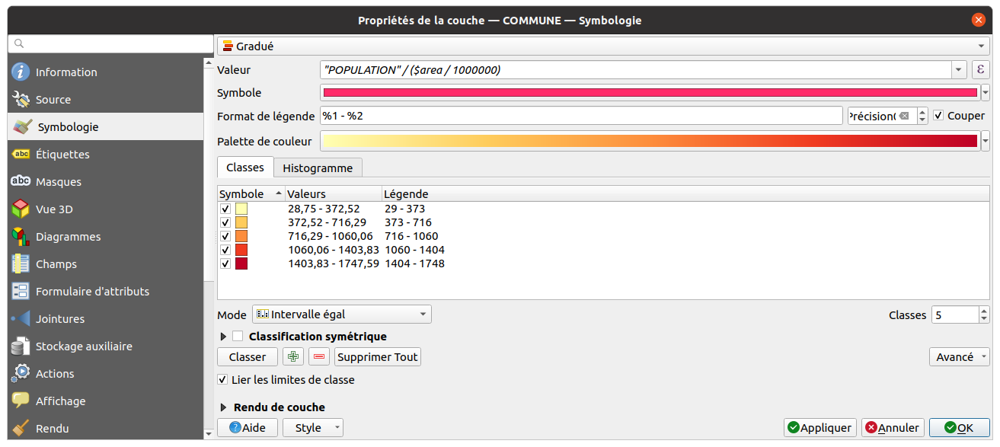
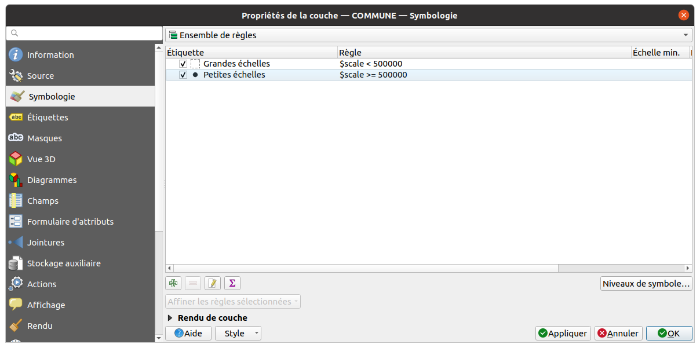
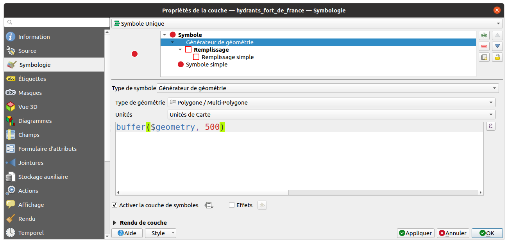
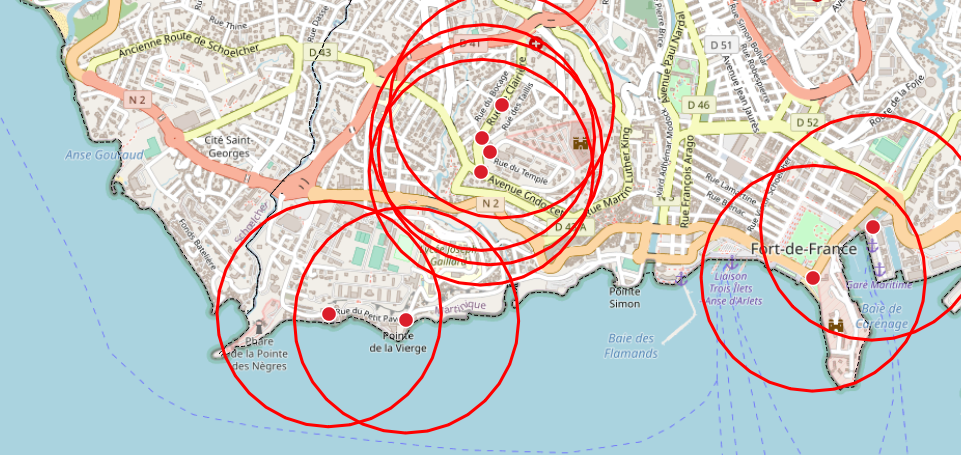

# La symbologie vecteur

Les expressions peuvent être utilisées dans QGIS pour **rendre plus dynamique**
la symbologie des couches vecteurs:

* calcul via une expression pour **classer les entités** au lieu d'utiliser un champ.
* filtrer quelles entités doivent être rendues par telle symbologie via des filtres
* contrôler toutes les **propriétés** via une expression (échelle, couleur, taille, etc.)
* **créer des géométries** pour l'affichage (tampons, lignes entre objets)

!!! tip
    Vous pouvez consulter le chapitre (Symbologie vectorielle)[https://docs.3liz.org/formation-qgis/symbologie-vecteur/)
    de notre formation QGIS pour un rappel sur les règles de symbologie dans QGIS.

## La symbologie graduée et catégorisée

Dans l'onglet symbologie, au lieu d'appeler un champ de la couche à représenter,
il est tout à fait possible d'**utiliser une expression**.

Quelques exemples :

* Faire une classification sur une **densité de population** sans avoir besoin
  d'avoir un champ (virtuel ou non): `"POPULATION" / ($area / 1000000)`
* Faire une classification sur l'ensemble des valeurs possibles prises par 2 champs :
  `concat("CATEGORIE", ' - ', "IMPORTANCE")`




## La symbologie par ensemble de règles

Ce type de symbologie est très utile si vous souhaitez contrôler quels symboles
sont rendus en fonction des entités, ou d'autres caractéristiques (échelles)

Par exemple, on peut choisir de rendre les polygones des communes comme

* des **points** à petite échelle : `$scale >= 500000`
* des **polygones** à grande échelle : `$scale < 500000`

Pour cela, il faut ouvrir les **propriétés de la couche**, dans l'onglet `Symbologie`
et choisir le mode `Ensemble de règles

`

## Contrôle les symboles à l'aide d'une expression

Quasiment toutes les propriétés de la symbologie (et des étiquettes)
peuvent être **contrôlées à l'aide d'expressions**.

Pour cela, on doit activer l'Epsilon 
à la place du symbole suivant 

Il est ainsi possible de choisir

* la **taille** d'un symbole,
* la **couleur** d'une bordure,
* l'**échelle** d'affichage,
* le fait que la donnée soit affichée ou non,
* modifier la symbologie ou les étiquettes des objets sélectionnés :
  ```sql
  CASE
    WHEN is_selected() THEN 'blue'
    ELSE 'red'
  END
  ```
* la rotation des symboles à partir d'un champ
  (Ex: angle de prise de vue d'une photographie)

Un exemple amusant :


!!! danger
    Attention à ne pas utiliser les expressions alors que des moyens
    plus simples et plus performants existent.
    Par exemple pour faire varier une couleur sur 5 classes: utiliser
    la symbologie catégorisée.

## Créer des géométries dynamiques

Voir l'exemple sur la [Calculatrice](./calculatrice.md) pour la création
de géométries à partir de champs de la couche

Sinon, on peut aussi créer **dynamiquement des géométries**, avec le **générateur de géométries** par exemple :

* Ouvrir le fichier [des Hydrants de Fort-de-France (@ contributeurs OSM)](./media/hydrant_fort_de_france.geojson)
* Ouvrir la symbologie
* Ajouter un niveau de symbole
* Utiliser le mode "Générateur de géométrie"
* Créer un **tampon de 500 mètres** autour de points via :
  ```sql
  buffer($geometry, 1000)
  ```

Configuration :



Le résultat :



!!! tip
    Dans l'expression, on pourrait très bien faire varier la distance tampon
    en fonction de la valeur d'un champ ou d'un calcul

On peut aussi créer des lignes entre objets, avec la fonction `make_line`.

## Quelques exemples d'expression

Certains utilisateurs sont assez créatifs et inventent
de nouvelles utilisations des expressions :

* **Couleur continue** pour un vecteur basé sur une palette de couleur https://twitter.com/Qgis_Bzh/status/1207974981918973962
* **Rotation ou taille** qui dépend de la **position du curseur** https://twitter.com/kgjenkins/status/1298363142070767617
* **Lisser** les courbes de niveau SRTM https://twitter.com/timlinux/status/1331645809834811394
* Modifier la symbologie ou les étiquettes des **objets sélectionnés** `is_selected() = True`
* [Symbologie différente pour une entité au centre de la carte](https://demo.lizmap.com/lizmap/index.php/view/map/?repository=feat1&project=expression_map)
* Couleur d'étiquette basée sur la **visibilité d'une couche** `is_layer_visible()`: https://twitter.com/northroadgeo/status/1208299125604638720
* Trouver le **point le plus proche** : https://twitter.com/spatialthoughts/status/1421038975955791873 et https://www.youtube.com/watch?v=iCgDIxUGAp0&t=113s
* Lire les données **EXIF d'une image JPG** https://github.com/qgis/QGIS/commit/754328cbd0a4e5251f03c444221988a7031f4cef
* Récupérer un tableau des éléments d'une **multi-géométrie**: https://twitter.com/cartocalypse/status/1386647274416181253
* Utiliser `eval` pour créer des **expressions dans des expressions**. Ex: somme des 31 colonnes de données pour récupérer la somme par mois:
  ```sql
  eval(
    array_to_string(
      array_foreach(
        generate_series(1, 31),
        concat("VALUE", @element, '"')), ' + '
      )
  )
  ```
* Déplacer des points de manière aléatoire (floutage)
  ```sql
  with_variable(
    'distance_floutage',
    1000,
    translate(
      $geometry,
      randf(-1 * @distance_floutage, @distance_floutage),
      randf(-1 * @distance_floutage, @distance_floutage)
    )
  )
  ```
* [Usage détourné de QGIS pour afficher un graphique interactif](https://twitter.com/etrimaille/status/1281166495935008769)
  avec le **Time Manager**
* ou alors pour [refaire le jeu du morpion](https://www.youtube.com/watch?v=BzCxmg5HgwY)
