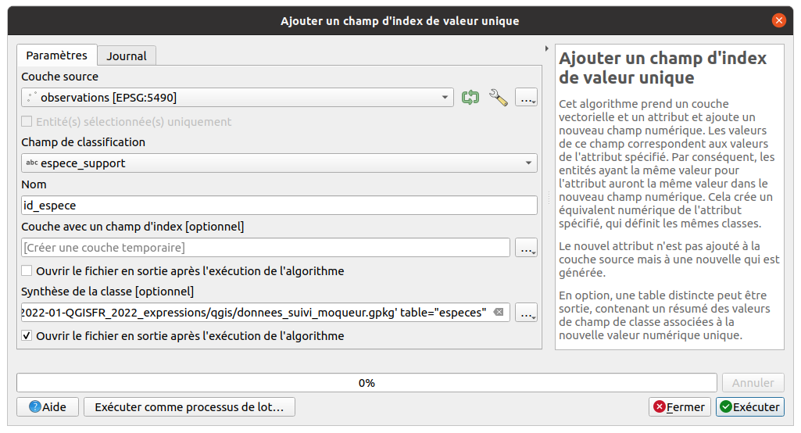

# TP - Annexes

## Quelques expressions au fil de l'eau

??? note "Créer un lien Google Street View"

	```sql
    with_variable(
        'point',
        transform(
            centroid($geometry),
             @layer_crs,
            'EPSG:4326'
        ),
        concat(
            'http://maps.google.com/maps?q=&layer=c&cbll=',
            y(@point) || ',' || x(@point),
            '&cbp=11,0,0,0,0'
        )
    )
	```

??? note "Déplacer des points aléatoirement"

	```sql
	with_variable(
		'distance_floutage',
		1000,
		translate(
			$geometry,
			randf(-1 * @distance_floutage, @distance_floutage),
			randf(-1 * @distance_floutage, @distance_floutage)
		)
	)
	```

??? note "Utiliser `eval` pour créer des **expressions dans des expressions**"

    Par exemple : somme des 31 colonnes de données pour récupérer la somme par mois:
    ```sql
    eval(
        array_to_string(
        array_foreach(
            generate_series(1, 31),
            concat("VALUE", @element, '"')), ' + '
        )
    )
    ```

??? note "Générer un texte aléatoire"
    ```sql
    array_to_string(
        array_foreach(
            generate_series(1,10),
            replace(
                @element,
                @element,
                char(rand(97,122))
            )
        ), ''
    )
    ```

??? note "Générer un UUID"

    Utile pour définir un code unique à une entité (terrain)
    ```sql
    uuid('WithoutBraces')
    ```

## Quelques liens

* **Couleur continue** pour un vecteur basé sur une palette de couleur https://twitter.com/Qgis_Bzh/status/1207974981918973962
* **Rotation ou taille** qui dépend de la **position du curseur** https://twitter.com/kgjenkins/status/1298363142070767617
* Lisser les **courbes de niveau** SRTM https://twitter.com/timlinux/status/1331645809834811394
* Modifier la symbologie ou les étiquettes des **objets sélectionnés** `is_selected() = True`
* Couleur d'étiquette basée sur la **visibilité d'une couche** `is_layer_visible()`: https://twitter.com/northroadgeo/status/1208299125604638720
* Trouver le **point le plus proche** : https://twitter.com/spatialthoughts/status/1421038975955791873 et https://www.youtube.com/watch?v=iCgDIxUGAp0&t=113s
* Lire les données **EXIF d'une image JPG** https://github.com/qgis/QGIS/commit/754328cbd0a4e5251f03c444221988a7031f4cef
* Récupérer un tableau des éléments d'une **multi-géométrie**: https://twitter.com/cartocalypse/status/1386647274416181253


## Créer une table avec les espèces uniques depuis la table observations

* Utiliser l'algorithme `Ajouter un champ d'index de valeur unique` qui va produire une **nouvelle table** contenant les valeurs distinctes du champ `espece_support`. Ouvrir la table via l'**explorateur**




* La table `especes` a bien été créée dans le GeoPackage `donnees_suivi_moqueur.gpkg`.
  On l'ouvre dans le projet
* Elle contient les champs `fid`, `id_espece` et `espece_support`
* On va conserver uniquement le `fid` et le champ `espece_support`, qu'on renomme
  en `nom_scientifique`, en modifiant la table depuis les propriétés de la couche,
  onglet `Champs`
* On ajoute un identifiant unique `uid` de type `Texte` avec la calculatrice de champ
  et l'expression `regexp_replace(uuid(), '[{}]', '')`

  
