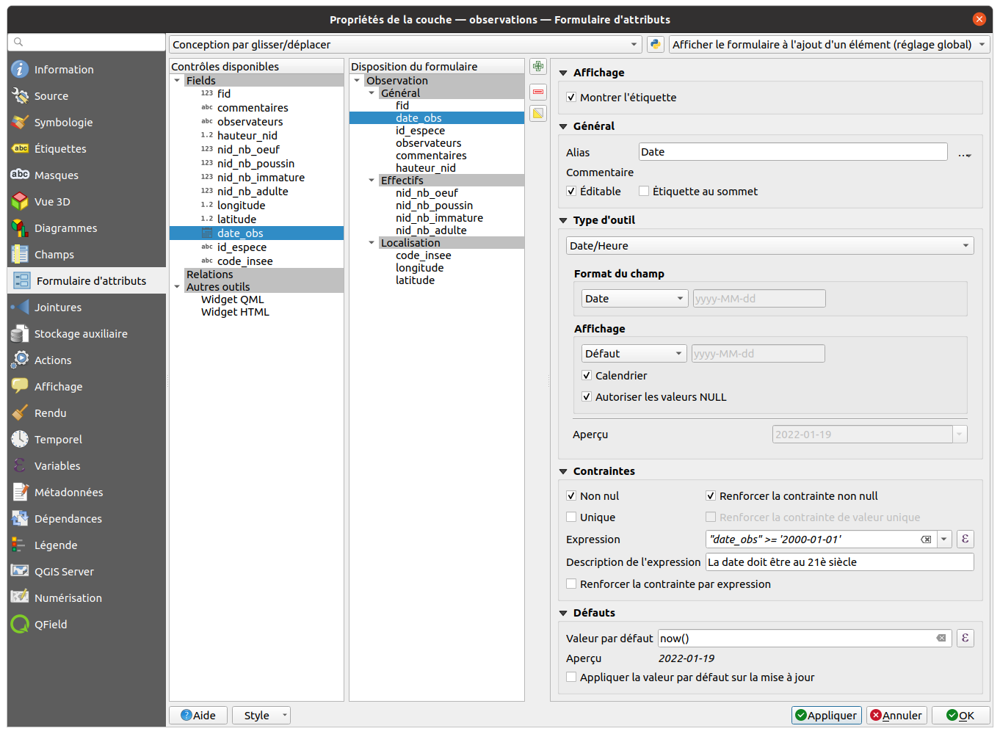

# TP - Construire un formulaire de saisie

On souhaite **contrôler la saisie** des observations. Pour cela, on peut configurer
finement comment va s'afficher le **formulaire d'édition** dans QGIS.

## Réorganiser les champs

On ouvre les propriétés de la couche `observations`, menu **Formulaire** :

* On passe en mode `Conception par glisser/déplacer`
* Pour chaque champ, on clique sur son nom, on ajoute un `alias`
* On **réordonne les champs** dans l'ordre souhaité.
* On peut créer des **groupes** et y déplacer les champs

## Modifier les propriétés des champs

* Pour certains champs, on les marque en **non éditable** :
  `fid`, `longitude`, `latitude`
* On choisit pour chacun le `type d'outil` pour chaque champ :
    * **Édition de texte** pour `fid, commentaire, observateurs`
    * **Référence de la relation** pour `id_espece` et `code_insee`
      avec `Autoriser la valeur NULL`, `Trier par valeur` et
    * **Date/Heure** pour `date_obs`
    * **Plage** pour les champs `hauteur_nid`, `nid_nb_oeuf`,
      `nid_nb_poussin`, `nid_nb_immature`, `nid_nb_adulte` entre 0 et 100
* On ajoute des **contraintes** : `Non null` et `Renforcer la contrainte non null`
  pour les **champs obligatoires**
* On peut ajouter des contraintes spécifiques :  `"date_obs" > '2000-01-01'`
  pour forcer une date après 2000
* On peut utiliser des expressions pour les **valeurs par défaut**:
    * `now()` pour la date,
    * `x($geometry)` et `y($geometry)` pour les **coordonnées**

La configuration du formulaire

* pour le champ `date_obs` :
  
* pour le champ `id_espece` :
  

#  Le formulaire de saisie

Vous pouvez tester le formulaire en passant la couche en **mode édition**,
puis en créant une nouvelle observation :

* les **listes déroulantes** seront remplies à partir des **autres tables**
* les **valeurs par défaut** seront visibles dès l'ouverture du formulaire
* Les **valeurs incorrectes** entraîneront l'incapacité de sauvegarde le formulaire

!!! tip
    À noter que le formulaire est aussi affiché ainsi dans la **table attributaire**,
    lorsqu'on active la **vue formulaire** (bouton en bas à droite de la fenêtre)
