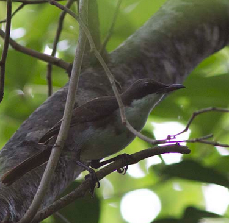
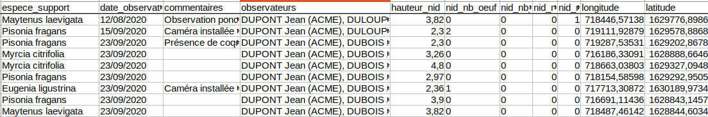
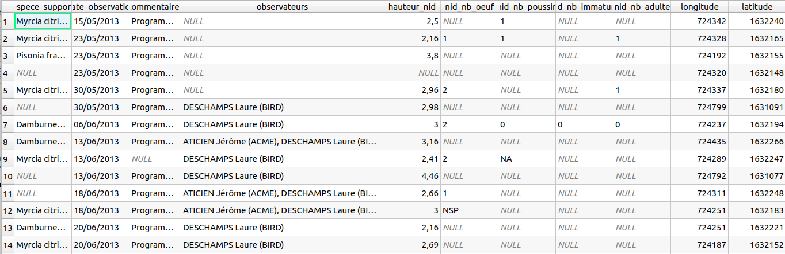
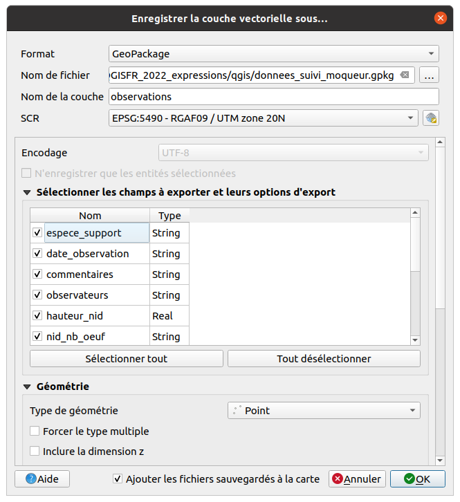

# TP - Introduction et import de la donnée source dans QGIS

## L'exemple choisi

* On fait des **observations faunistiques** sur le terrain:
  **Moqueur Gorge Blanche** à la Martinique
* La saisie est historiquement faite **dans un tableur** (MS Excel ou LibreOffice Calc)
* Une observation est
    * un **point** avec une longitude et une latitude,
    * faite à une **date**,
    * par des **observateurs**
    * On doit respecter une certaine **nomenclature**

## Les données source

Un fichier au format LibreOffice Calc [observations_source.ods](./media/observations_source.ods)

## Importer la donnée source

* On ajoute la donnée dans QGIS, par glisser-déplacer du fichier LibreOffice dans QGIS
* On ouvre les propriétés de la couche `observations_source`
  et visualise les champs dans l'onglet **Champs**

## Étudier la donnée source

On visualise la table attributaire qui reprend bien ce qu'on avait dans LibreOffice:

## Sauvegarder cette donnée en GeoPackage

On sauvegarde dans un **GeoPackage** `donnees_suivi_moqueur.gpkg`
dans le **répertoire du projet**, table `observations`, de type `Point`
même si la table initiale n'est pas spatiale

## Ouverture de la couche du GeoPackage dans QGIS

On a **importé** le fichier tableur LibreOffice dans un **Geopackage**
comme une couche de **Points**.

* Via l'**explorateur** de QGIS, on cherche le **Dossier du projet**,
* On double-clique sur le fichier `donnees_suivi_moqueur.gpkg`
* ajoute la nouvelle table `observations` au projet
* On configure la **projection**, dans notre cas `EPSG:5490`, UTM Zone 20N (Martinique)
* On modifie la **symbologie** (gros points bleus avec bordure blanche)

