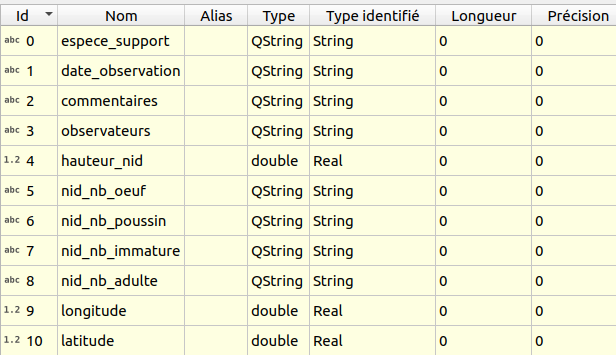

# TP - Import de la donnée source dans QGIS

## Description de la donnée

Les données d'observation sont enregistrées dans un fichier
au format **LibreOffice Calc** [observations_source.ods](./qgis/observations_source.ods)

Vous pouvez [récupérer ce fichier](./qgis/observations_source.ods) et le **sauvegarder dans un répertoire
de votre ordinateur**.

Voici un aperçu des données du fichier :

!!! hint "Données fictives"

    Les données contenues dans ce document sont des **données fictives**

    * Les noms des **observateurs** ont été inventés
    * les **positions spatiales** des observations sont le fruit du hasard
      et ne correspondent pas à la réalité

## Importer la donnée source

* On ajoute la donnée dans QGIS, par **glisser-déplacer** du fichier LibreOffice dans QGIS
* Cela ajoute une **nouvelle couche** `observations_source` dans le panneau `Couches`.
* On ouvre les **propriétés** de la couche `observations_source`
  puis on visualise les champs dans l'onglet `Champs`

QGIS a reconnu automatiquement certains **formats** (hauteur_nid, longitude et latitude en réel)
mais pas tous.

!!! note "Enregistrer le projet QGIS"

    Pour faciliter la suite du TP, nous conseillons d'**enregistrer le projet**
    QGIS dans le même répertoire que celui où vous avez déposé le fichier
    LibreOffice. Par exemple avec le nom `tp_expressions.qgs`

## Étudier la donnée source

On visualise la **table attributaire** qui reprend bien ce qu'on avait
dans LibreOffice :

## Sauvegarder cette donnée en GeoPackage

On sauvegarde cette couche dans un **GeoPackage** `donnees_suivi_moqueur.gpkg`
via un clic-droit et `Exporter / Sauvegarder les entités sous` :

* Format `GeoPackage`
* dans le **répertoire du projet** avec le nom `donnees_suivi_moqueur.gpkg`,
* nom de table : `observations`,
* projection : `EPSG:5490`, UTM Zone 20N (Martinique).
* **géométrie** de type `Point` **même si la table initiale n'est pas spatiale**

## Ouverture de la couche du GeoPackage dans QGIS

Si la couche n'a pas déjà été ouverte après la sauvegarde,
on **ajoute** cette couche issue du nouveau fichier **Geopackage**
comme une couche de **Points** dans QGIS.

* Via l'**explorateur** de QGIS, on cherche le **Dossier du projet**.
* On double-clique sur le fichier `donnees_suivi_moqueur.gpkg`.
* On ajoute la nouvelle table `observations` au projet.
* On configure la **projection**, dans notre cas `EPSG:5490`, UTM Zone 20N (Martinique).
* On modifie la **symbologie** (gros points bleus avec bordure blanche).

!!! note

    Aucun point n'est visible sur la carte, car les géométries
    n'ont pas encore été créées à partir des champs de `longitude` et `latitude`
