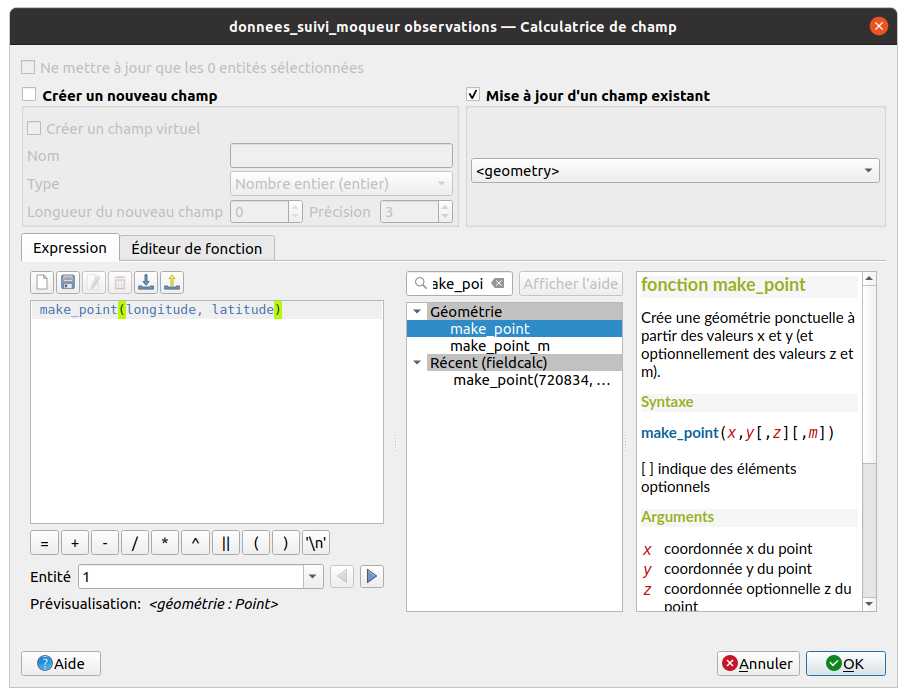
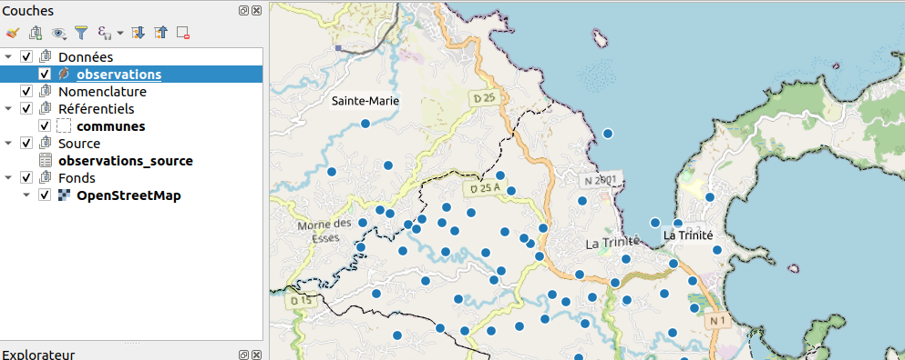
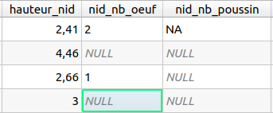

# TP - Modification et nettoyage des données

## Modifier la géométrie via une expression

On va définir les points via **la longitude et latitude** et une expression :

* On passe cette couche en édition
* On utilise la calculatrice de champs et on modifie la géométrie
  via l'expression `make_point("longitude", "latitude")`

 

## On visualise alors les points sur la carte

Les géométries sont bien créées et correspondent aux coordonnées. On **sauvegarde** les données via la disquette de la **barre de numérisation** !



## On nettoie les valeurs des champs avec des entiers

Les valeurs **non entières** `NAN`, `NSP`, `Inconnu`, `RAS` ne doivent pas
apparaître dans les champs qui attendent des **entiers**


On peut appliquer une expression avec la **calculatrice de champ** sur
tous les champs qui doivent contenir des entiers:
`nid_nb_oeuf`, `nid_nb_poussin`, `nid_nb_immature`, `nid_nb_adulte`

* Soit une expression simple si on veut seulement remplacer `NSP` par du vide `NULL` :
  ```sql
  -- On remplace 'NSP' par NULL
  Nullif(
      replace(trim("nid_nb_oeuf"), 'NSP', ''),
      ''
  )
  ```

* Soit avec une **expression plus complexe** qui permet de remplacer
  tout ce qui n'est pas un entier en valeur `NULL`

    * Utilisation de `CASE ... WHEN ... THEN ... END`
    * Utilisation de `regexp_match`
    * Conversion en entier via `to_int`

    ```sql
    -- Une condition avec une expression régulière pour ne conserver que les entiers
    CASE
        WHEN regexp_match(trim("nid_nb_oeuf"), '^\\d+$')
            THEN to_int(trim("nid_nb_oeuf"))
        ELSE NULL
    END
    ```

Pour  `nid_nb_oeuf`, `nid_nb_poussin`, `nid_nb_immature`, `nid_nb_adulte`




On doit maintenant utiliser le **Gestionnaire de bases de données** pour changer le type
des champs `nid_nb_xxxx` de **Texte** à **Entier**

* On crée une **connexion** vers le GeoPackage
* Sur la table `observations`, on ouvre le menu **Table** > **Modifier une table**,
  et on choisit le type `SMALLINT` ou `INTEGER`


## On transforme un champ texte en Date

Exemple du champ `date_observation` de type texte, qui contient par exemple
un texte `26/06/2013`:

* On crée un nouveau champ `date_obs` de type `Date` via la
  **calculatrice de champ** avec:
  ```sql
  to_date("date_observation", 'dd/MM/yyyy')
  -- on aura donc: 2013-06-26
  ```
* On obtient
  
* On supprime le champ `date_observation`
* On enregistre

On pourra donc faire des **calculs de date**, par exemple
l'âge en jours de l'observation, via :
  ```sql
  to_int(
    day(age(now(), "date_obs"))
  )
  ```
  qui renverra par exemple `128` jours
* Ou tester si la date donnée est bien **inférieure ou égale** à la date du jour
  ```sql
  "date_obs" <= now()
  ```
  qui renverra `Vrai` ou `Faux`
