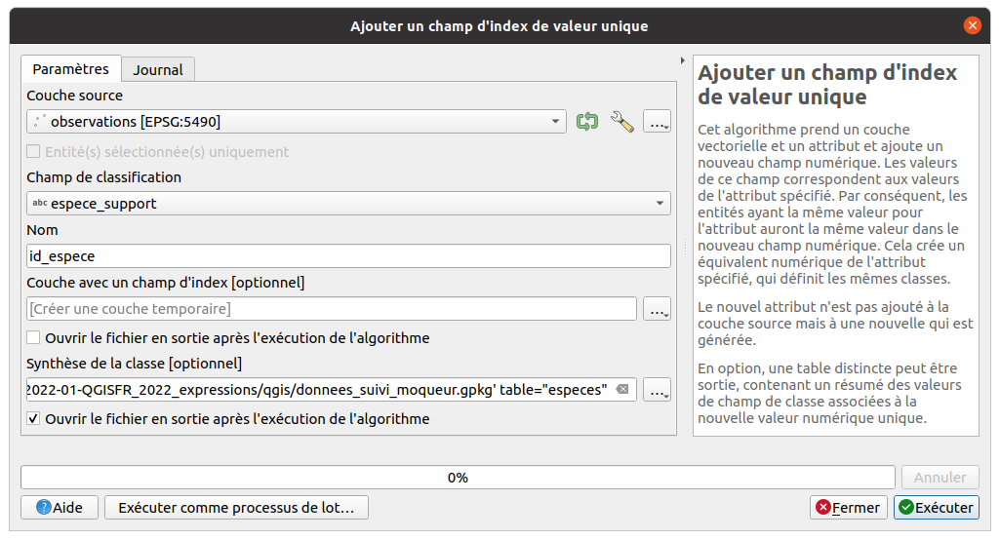
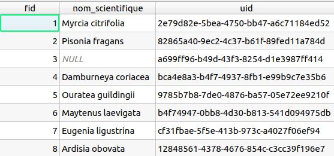
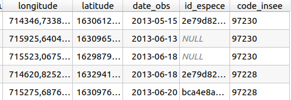
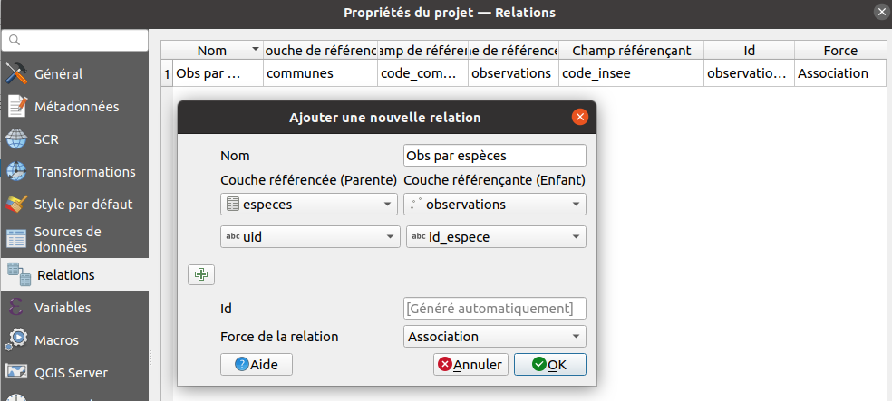
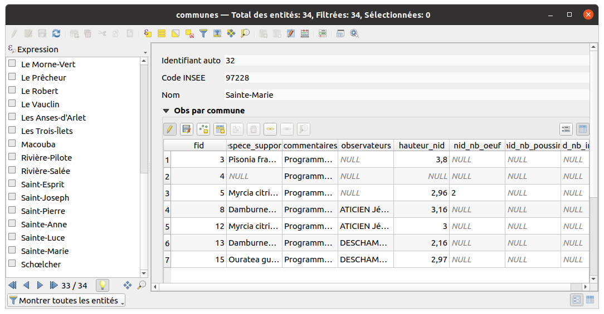

# TP - Créer des relations entre les données vectorielles

QGIS permet de décrire comment les données de différentes couches
sont reliées entre-elles. On parle de **relations**. Le cas le plus connu
est le lien entre un objet spatial et la commune via le code INSEE.

Avec les données exploitées dans notre exemple d'observations, on va relier :

* les observations avec une table qui **liste les espèces**
* les observations avec les **communes**

## On veut créer une table de nomenclature pour les espèces

On souhaite faire une nouvelle table non spatiale dans le Geopackage:

* table `especes`: pour stocker la liste des espèces support (arbres ou arbustes)

Dans la table source, on a pour l'instant un nom d'espèce dans le champ `espece_support`:

  
On pourra ensuite créer des **relations** entre les **observations** et les **espèces**


## Créer une table avec les espèces uniques

* Utiliser l'algorithme `Ajouter un champ d'index de valeur unique` qui va produire une **nouvelle table** contenant les valeurs distinctes du champ `espece_support`. Ouvrir la table via l'**explorateur**




* La table `especes` a bien été créée dans le GeoPackage `donnees_suivi_moqueur.gpkg`.
  On l'ouvre dans le projet
* Elle contient les champs `fid`, `id_espece` et `espece_support`
* On va conserver uniquement le `fid` et le champ `espece_support`, qu'on renomme
  en `nom_scientifique`, en modifiant la table depuis les propriétés de la couche,
  onglet `Champs`
* On ajoute un identifiant unique `uid` de type `Texte` avec la calculatrice de champ
  et l'expression `regexp_replace(uuid(), '[{}]', '')`

  

## Ajouter une clé étrangère dans la table observations avec l'id de l'espèce

Avec la calculatrice de champs, pour la couche `observations`,
on ajoute un champ `id_espece` de type `Texte` et on va
le **remplir à l'aide d'une expression** basée sur :

* la méthode `get_feature` qui permet de récupérer une ligne d'une autre couche,
  ici `especes` en faisant la correspondance entre les valeurs (comme pour une jointure)
* la méthode `attributes` qui permet de récupérer les valeurs des champs
  pour cette ligne, ici pour récupérer l'`uid`créé précédemment

  ```sql
  attributes(
      get_feature(
          'especes',
          'nom_scientifique',
          "espece_support"
      )
  )['uid']
  ```

* On a bien l'`uid` de l'espèce ajouté dans le champ `id_espece`


* On peut supprimer le champ `espece_support` qui ne servira plus


## Récupérer automatiquement la commune de chaque observation

Les **expressions** permettent de gérer les données en relation, par exemple
via la méthode `aggregate`: on va récupérer le **code INSEE** de la commune
de chaque observation, par **intersection** entre leurs géométries

* on crée un nouveau champ `code_insee` de type `Texte`avec l'expression

  ```sql
  aggregate(
    layer:='communes',
    aggregate:='max', expression:="code_commune",
    filter:=intersects($geometry, geometry(@parent))
  )
  ```
* On obtient bien le nouveau champ `code_insee` dans la table
  


## Créer des relations entre les observations, les communes et les espèces

Dans les **propriétés du projet QGIS**, onglet **Relations**, créer

* Une relation entre les `observations` et les `communes`
* Une relation entre les `observations` et les `especes`




## Visualiser via la table attributaire les données en relation

* Ouvrir la **table attributaire** des `especes`
* Passer en **vue "Formulaire"** via le petit bouton en bas à droite du tableau
* Sélectionner une **commune** et voir les données d'observations liées


