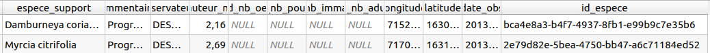

# TP - Créer des relations entre les données vectorielles

QGIS permet de décrire comment les données de différentes couches
sont reliées entre-elles. On parle de **relations**. Le cas le plus connu
est le lien entre un objet spatial et la commune via le code INSEE.

Avec les données exploitées dans notre exemple d'observations, on va relier :

* les observations avec une table qui **liste les espèces**
* les observations avec les **communes**

## Charger les données "especes" et "communes"

Pour pouvoir montrer la gestion des relations dans QGIS, nous allons
charger **deux nouvelles couches** du fichier [donnees.gpkg](qgis/donnees.gpkg).

Enregistrez ce fichier **à côté de votre projet QGIS** puis via l'explorateur
dans le menu `Dossier du projet`, ouvrir l'arbre et charger :

* la table non spatiale `especes`
* la table spatiale des `communes`


## On veut créer une table de nomenclature pour les espèces

Dans la table source, on a pour l'instant un nom d'espèce
dans le champ `espece_support`:


On souhaite faire le lien entre la table `especes` et les observations
par le biais de ce champ `espece_support`.

On pourra ensuite créer une **relation** entre les **observations** et les **espèces**.

## Ajouter une clé étrangère dans la table observations avec l'id de l'espèce

Avec la calculatrice de champs, pour la couche `observations`,
on ajoute un champ `id_espece` de type `Texte` et on va
le **remplir à l'aide d'une expression** basée sur :

* la méthode `get_feature` qui permet de récupérer une ligne d'une autre couche,
  ici `especes` en faisant la correspondance entre les valeurs (comme pour une jointure)
* la méthode `attributes` qui permet de récupérer les valeurs des champs
  pour cette ligne, ici pour récupérer l'`uid`créé précédemment

  ```sql
  attributes(
      get_feature(
          'especes',
          'nom_scientifique',
          "espece_support"
      )
  )['uid']
  ```

* On a bien l'`uid` de l'espèce ajouté dans le champ `id_espece`


* On peut supprimer le champ `espece_support` qui ne servira plus


## Récupérer automatiquement la commune de chaque observation

Les **expressions** permettent de gérer les données en relation spatiale :
on va récupérer le **code INSEE** de la commune de chaque observation,
par **intersection** entre leurs géométries.

* Avec la **calculatrice de champs** on crée un nouveau champ `code_insee`
  de type `Texte`avec une expression de relation par intersection :

??? note "Récupérer le code de la commune en intersection"
    * `overlay_intersects` est une méthode efficace pour cela. Elle
      renvoie un tableau. On peut donc récupérer le premier élément
      via le `[0]`.
    ```sql
      overlay_intersects(
        layer:='communes',
        expression:="code_commune",
        limit:=1
      )[0]
    ```
* On obtient bien le nouveau champ `code_insee` dans la table
  


## Créer des relations entre les observations, les communes et les espèces

Dans les **propriétés du projet QGIS**, onglet **Relations**, créer

* Une relation entre les `observations` (champ `code_insee`) et les `COMMUNE` (champ `INSEE_COM`)
* Une relation entre les `observations` (champ `id_espece`) et les `especes` (champ `uid`)


## Visualiser via la table attributaire les données en relation

* Ouvrir la **table attributaire** des `especes`
* Passer en **vue "Formulaire"** via le petit bouton en bas à droite du tableau
* Sélectionner une **commune** et voir les données d'observations liées


