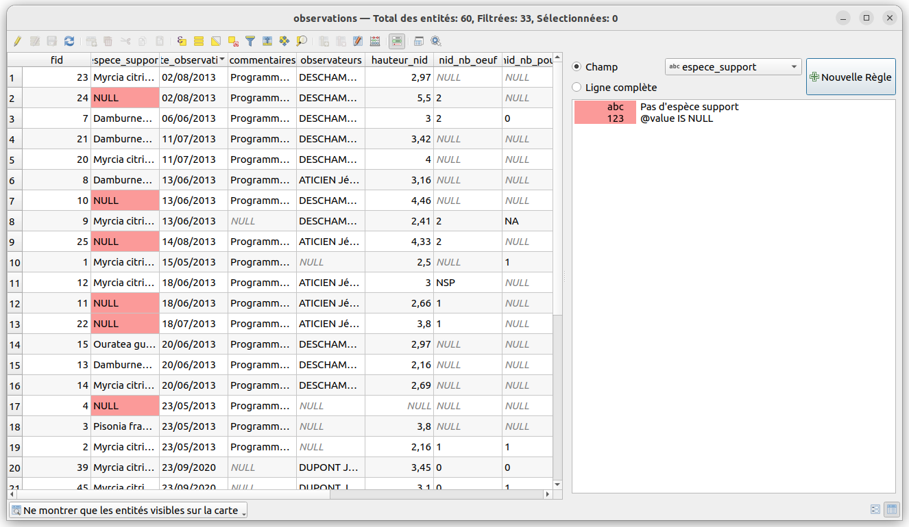

# TP - Mise en forme de la table attributaire

Il est possible avec les expressions de fixer des **règles d'affichage**
des cellules et des lignes de la table attributaire.

On peut par exemple vérifier que certaines valeurs sont bien saisies
ou si la date de l'observation est **trop ancienne** (et alors programmer de retourner
observer sur le site)

```sql
-- observations anciennes
-- cad plus de 100 jours
to_int(
    day(
        age(now(), "date_obs")
    )
) > 100
```


