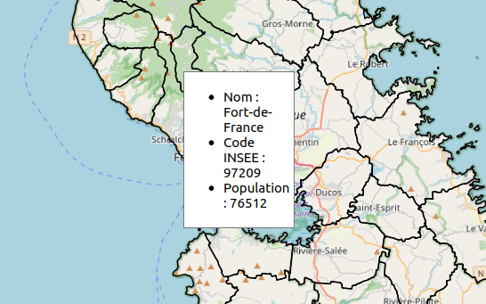
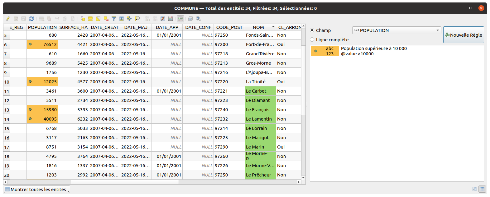

# Les outils de visualisation

## Le nommage d'une entité

Pour tester l'éditeur, nous allons modifier le `Nommage d'une entité`, accessible depuis les **propriétés d'une couche vectorielle**, dans l'**onglet** `Infobulle`

Cela permet de dire à QGIS quel est l'**expression** qu'il doit utiliser
pour nommer de manière unique les entités. C'est utile notamment :

* dans la **table attributaire** en mode d'affichage par **formulaire**
* dans l'**outil de recherche** `CTRL+K` de QGIS
* dans l'outil d'**indentification** lorsqu'on fait un clic-droit sur la carte
* dans l'**éditeur d'expressions**, dans la liste déroulante du **prévisualisateur**

Par exemple, sur une couche **COMMUNE**, on peut mettre le nom du champ :

* à l'aide du **menu déroulant**, on peut choisir le nom d'un champ, `NOM`.
* en cliquant sur l'`epsilon` violet, on arrive dans la fenêtre des expressions de QGIS :
    1. Effacer le contenu à gauche
    2. Dans le panneau du milieu, aller dans `Champs et Valeurs` et double-cliquer sur le nom du champ `NOM`.
    3. Remarquer l'ajout dans le panneau à gauche de l'expression suivante `"NOM"`.
    4. Cliquer sur OK
    5. Cette expression est équivalente à la première, mais elle est plus correcte syntaxiquement.

**Rappels**:

* le **nom d'un champ** est entre guillemet double `""`.
* une **chaîne de caractère** entre guillemet simple `'`.

Retournons dans la fenêtre des expressions. Nous souhaitons dorénavant afficher **le nom** de la commune, la chaîne de
caractère ` : ` et le **code INSEE** de la commune.
    * Effacer le contenu à gauche
    * Dans le panneau du milieu, aller dans `Champs et Valeurs` et double-cliquer sur le nom du champ `NOM`.
    * Contrairement aux noms des champs qui sont entre guillemet double `""`, les chaînes de caractères sont entre guillemet simple `''`
    * Pour concaténer, on peut utiliser `||`, `+` ou la fonction `concat()`
    * Une solution possible `concat("NOM", ' : ', "INSEE_COM")`

!!! tip
    Pensez bien à lire la **documentation** de ces fonctions de concaténations, surtout sur la gestion des valeurs `NULL`.

!!! tip
    Une fois le nommage d'entité effectué, vous pouvez **lancer une recherche**
    dans la couche via le champ de recherche rapide en bas à gauche
    (raccourci `CTRL+K`)


## Les infobulles

Comme on l'a fait pour le nommage des entités, on peut définir l'**infobulle** de la couche
avec des expressions QGIS. On utilise cette fois-ci du `HTML` pour la **mise en forme**.

* Pour activer les **infobulles** sur la carte, menu `Vue` ▶ `Afficher les infobulles`.
* Puis retourner dans les **propriétés de la couche vecteur**, onglet `Affichage`, bloc `Infobulle HTML`.

**Rappel succinct** sur du `HTML` pour faire une **liste à puce** :

```html
<h3>Titre</h3>
<p>Paragraphe</p>
<ul>
    <li>Une</li>
    <li>liste</li>
    <li>à</li>
    <li>puce</li>
</ul>
```

!!! tip
    Vous pouvez utiliser un éditeur de code HTML en mode `WYSIWYG`
    par exemple https://bestonlinehtmleditor.com

* Les balises `<h1></h1>`, `<h2></h2>`, `<h3></h3>` représentent des titres, en commençant par le plus important. En anglais **header**.
* `<p></p>` est un paragraphe
* `<ul></ul>` est une liste à puce non ordonnée. En anglais **unordered list**.
* `<li></li>` est un élément dans une liste. En anglais **list item**.

**NB:** Il est possible de personnaliser l'affichage de l'infobulle à l'aide de `CSS`.

Exemple d'une **infobulle** QGIS :

```html
<ul>
    <li>Nom : [% "NOM" %]</li>
    <li>Code INSEE : [% "INSEE_COM" %]</li>
    <li>Population : [% "POPULATION" %]</li>
</ul>
```

`[% ... %]` permet à QGIS de reconnaître qu'il s'agit d'une expression qu'il faut évaluer au sein d'un autre bloc de texte.




## La table attributaire : la mise en forme conditionnelle

Pour retrouver plus facilement des objets dans une grande table attributaire, on peut utiliser la fonctionnalité de QGIS de **mise en forme conditionnelle** des champs ou des lignes de la table.

Le principe est de fournir une ou plusieurs **règles**, via une **expression QGIS**, et d'y associer un **style** de champ ou de ligne. Par exemple

* Pour le `NOM` des communes : `@value LIKE 'Le%'`
* Pour la `POPULATION` : `@value > 10000`




## Le panneau statistique

Dans la barre d'outils `Attributs`, il existe un **outil de statistiques** sur un champ.

Il fonctionne à l'aide d'une **couche vecteur** en entrée ainsi que d'un champ de cette couche ou une expression.


